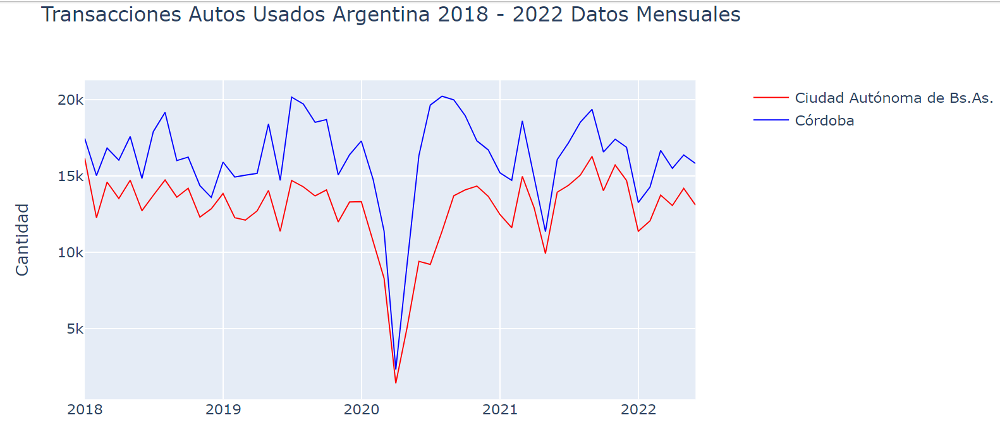

# datos-abiertos-argentina

<p align="center">

</p>

Analisis y pronosticos de transferencia de automotores en Argentina.


Trabajo en curso sobre visualizacion, estadisitica descriptiva y pronostico sobre transferencias de automotores para Argentina desde 2018 a 2022. El proposito final sera, luego de limpiar y visualizar bien los datos, generar series temporales a los efectos de poder predecir las transacciones futuras de compra y venta de autos usados. Se utilizaran distintos modelos de Time Series evaluando sus metricas y precision para estimar valores futuros.


<p>
<a href="https://scikit-learn.org/stable/" rel="nofollow"></a>
</p>


# Presentacion

El trabajo final se presenta en una Notebook de Jupyter y en un documentos R Markdown.

# Incluye

<ui>

<li>
Extraccion, Transformacion y Carga de Datos.
</li>

<li>
Limpieza del Data Set.
</li>

<li>
Graficos Dinamicos y Estaticos.
</li>

<li>
Time Series.
</li>

</ui>


<p align="center">
  
</p>


Los datos se pueden descargar de: 


<ui>
<li>
https://www.datos.gob.ar/
</li>
</ui>


Para descomprimir los archivos necesitamos las siguientes librerias y tener las url de los documentos .zip y guardarlos en _urls.txt_. 

Con el siguiente codigo se descrompimen los archivos en la carpeta y, por ultimo, se concatenan cada uno de los .csv que hay dentro usando concat de pandas.

```python

from io import BytesIO
from zipfile import ZipFile
from urllib.request import urlopen
from os import listdir

def find_csv_filenames(path_to_dir, suffix=".csv" ):
    filenames = listdir(path_to_dir)
    return [ filename for filename in filenames if filename.endswith( suffix ) ]

csv_files = [l for l in find_csv_filenames(folder_archivos, suffix=".csv" ) if 'autos' in l]

```


```python

with open('urls.txt', 'r') as folder_urls:
    lines_urls = folder_urls.readlines()

if len(csv_files) == 0:
    zipurls = lines_urls

    for zipurl in zipurls:
        with urlopen(zipurl) as zipresp:
            with ZipFile(BytesIO(zipresp.read())) as zfile:
                zfile.extractall(folder_archivos)

```


```python

list_data_frames = []

for file in csv_files:
    df_new = pd.read_csv(file)
    list_data_frames.append(df_new)

def unionAll(*dfs):
    return reduce(DataFrame.unionAll, dfs)

df = unionAll(*list_data_frames)

df = df.groupBy(['tramite_fecha','registro_seccional_provincia']).agg(count("registro_seccional_provincia").alias("count"))

df.toPandas().to_csv('df.csv')

```
