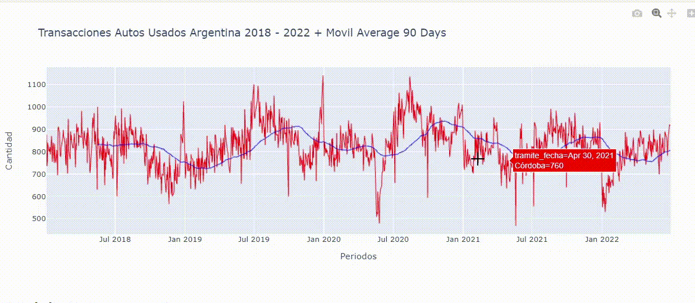
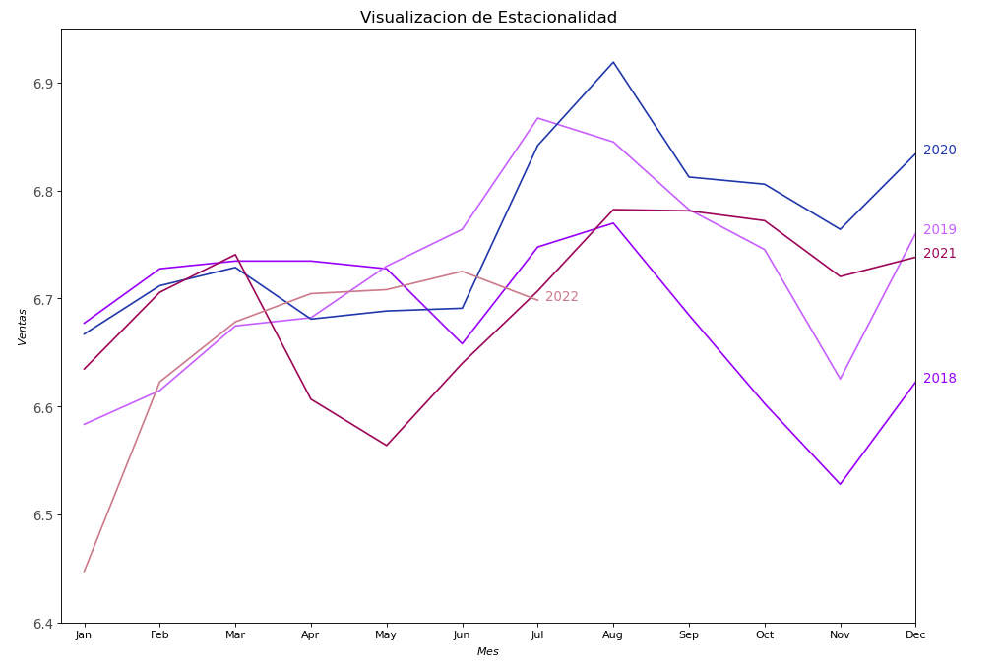

# datos-abiertos-argentina

<p align="center">

</p>

Analisis y pronosticos de transferencia de automotores en Argentina.

Trabajo en curso sobre la cantidad de transferencias de automotores para Argentina desde 2018 a 2022. El proposito final sera, luego de limpiar y visualizar los datos, generar series temporales a los efectos de poder predecir las transacciones futuras de compra y venta de autos usados. Se utilizaran distintos modelos de Time Series evaluando sus metricas y precision para estimar valores futuros.

Se utiliza la libreria Pyspark para hacer la extraccion y agregacion de los datos.

<p>
<a href="https://scikit-learn.org/stable/" rel="nofollow"></a>
</p>


# Presentacion

El trabajo final se presenta en una Notebook de Jupyter y en un documentos R Markdown con el analisis de las series temporales y los pronosticos.

# Incluye

<ui>

<li>
Extraccion, Transformacion y Carga de Datos.
</li>

<li>
Limpieza del Data Set.
</li>

<li>
Graficos.
</li>

<li>
Time Series.
</li>

</ui>

# Serie Temporal 

A continuacion una muestra de la serie temporal diaria con una media movil para suavizarla.

<p align="center">
  
</p>


Los datos se pueden descargar de: 

<ui>
<li>
https://www.datos.gob.ar/
</li>
</ui>

Para descomprimir los archivos necesitamos las siguientes librerias y tener las url de los documentos .zip y guardarlos en _urls.txt_. 

Con el siguiente codigo se descrompimen los archivos en la carpeta y, por ultimo, se concatenan cada uno de los .csv que hay dentro usando concat de pandas.

```python

from io import BytesIO
from zipfile import ZipFile
from urllib.request import urlopen
from os import listdir

def find_csv_filenames(path_to_dir, suffix=".csv" ):
    filenames = listdir(path_to_dir)
    return [ filename for filename in filenames if filename.endswith( suffix ) ]

csv_files = [l for l in find_csv_filenames(folder_archivos, suffix=".csv" ) if 'autos' in l]

```


```python

with open('urls.txt', 'r') as folder_urls:
    lines_urls = folder_urls.readlines()

if len(csv_files) == 0:
    zipurls = lines_urls

    for zipurl in zipurls:
        with urlopen(zipurl) as zipresp:
            with ZipFile(BytesIO(zipresp.read())) as zfile:
                zfile.extractall(folder_archivos)

```


```python

list_data_frames = []

for file in csv_files:
    df_new = pd.read_csv(file)
    list_data_frames.append(df_new)

def unionAll(*dfs):
    return reduce(DataFrame.unionAll, dfs)

df = unionAll(*list_data_frames)

df = df.groupBy(['tramite_fecha','registro_seccional_provincia']).agg(count("registro_seccional_provincia").alias("count"))

df.toPandas().to_csv('df.csv')

```


Luego de visualizar las series diarias elabore un grafico de series temporales con el promedio mensual de transacciones con el proposito de poder visualizar si existe estacionalidad a simple vista:

* Se pueden ver picos en algunos meses, podriamos deducir que hay estacionalidad a simple vista.

<p align="center">
  
</p>


Para el entrenamiento y testeo de los modelos de series temporales se van a estar utilizando los dias diarios. 
Con el siguiente codigo podemos dejar solo los dias habiles en el set de datos.

```python
from pandas.tseries.offsets import BDay
isBusinessDay = BDay().onOffset


match_series = pd.to_datetime(df['tramite_fecha']).map(isBusinessDay)

df = df[match_series]
```

Es importante tener en cuenta que cuando trabajamos con Time Series los datos de testeo deben ser los ultimos ya que vamos a pronosticar el futuro. Para poder separar bien el set de datos hay que setear shuffle en False.

```python

n_test = # Numero de valores para testear

train, test = train_test_split(dataframe, test_size = n_test, random_state = 10, shuffle = False)
```
